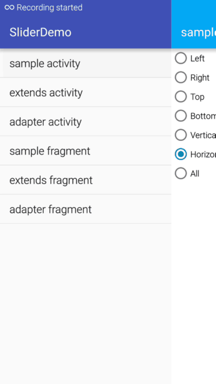

Slider  说明
=================================== 
1.基于[SwipeBackLayout](https://github.com/ikew0ng/SwipeBackLayout)和[Slidr](https://github.com/r0adkll/Slidr)开源项目进行功能的扩展补充<br />  
2.让任何页面通过简单的实现SliderUi接口即可拥有滑动功能<br />




## 使用方法

1.目前支持activity与fragment页面滑动

2.通过如下简单操作，即可让页面具备滑动功能。

```java
public class SampleActivity extends Activity implements  SliderUi
{
    @Override
    protected void onCreate(Bundle savedInstanceState) {
        super.onCreate(savedInstanceState);
        setContentView(R.layout.activity_slider);
        SliderUtils.attachUi(this, null)
    }
    
     @Override
    public Activity getUiActivity() {
        return this;
    }

    @Override
    public boolean isActivityUi() {
        return true;
    }

    @Override
    public boolean isFinishingUi() {
        return isFinishing();
    }

    @Override
    public void finishUi() {
        finish();
    }

    @Override
    public View getRootView() {
        return getWindow().getDecorView();
    }
}
```

亦或通过简单的继承:

```java
public class ExtendsActivity extends SliderActivity {
}
```
或者是直接通过SliderUtils类加入也可以达到想要的滑动效果。
```java
 SliderUtils.attachActivity(this, null);
```


需要注意的是activity在manifest下配置theme需复写android:windowIsTranslucent，否则拉开的背景会全黑。
```xml
 <style name="ActivityTheme" parent="Theme.AppCompat.Light.DarkActionBar">
        <item name="android:windowIsTranslucent">true</item>
    </style>
```
如果设备版本大于android 5.0，也可以如下代码。在低于5.0版本下如何能在代码中修改，目前没有深入，所以在此也希望大家能共同完善！
```java
SliderUtils.attachUi(this, null);
Utils.convertActivityToTranslucent activity)
```

关于fragment实现滑动功能，也基本可以通过类似的方式进行。而fragment不受android:windowIsTranslucent的影响。
```java
public class SampleFragment extends Fragment implements SliderUi
{  
    private ISlider iSlider;
    private View rootView;
    
    @Override
    public View onCreateView(LayoutInflater inflater, ViewGroup container,
                             Bundle savedInstanceState) {
        rootView = inflater.inflate(R.layout.fragment_sample, container, false);
        iSlider = SliderUtils.attachUi(this, null);
        return iSlider.getSliderView();
        }
        
         @Override
    public Activity getUiActivity() {
        return getActivity();
    }

    @Override
    public boolean isActivityUi() {
        return false;
    }

    @Override
    public boolean isFinishingUi() {
        return isRemoving();
    }

    @Override
    public void finishUi() {
        getUiActivity().getFragmentManager().beginTransaction().remove(this).commit();
    }

    @Override
    public View getRootView() {
        return rootView;
    }
}
```
或者通过继承,需要注意的是：在SliderFragment中onCreateView由于已经被final覆写了，所以要实现另一个抽象方法
creatingView并返回当前layout的inflate对象。
```java
public class ExtendsFragment extends SliderFragment
{
    @Override
    public View creatingView(LayoutInflater inflater, ViewGroup container, Bundle savedInstanceState) {
        return inflater.inflate(R.layout.fragment_entends, container, false);
    }
}
```
最简单的当然是直接把当前fragment传入SliderUtils.attachFragment(Fragment fragment, SliderConfig config,View rootView) 来实现：
```java
public class AdapterFragment extends Fragment{

    private ISlider iSlider;
    private View rootView;
    @Override
    public View onCreateView(LayoutInflater inflater, ViewGroup container,
                             Bundle savedInstanceState) {
        // Inflate the layout for this fragment
        rootView=inflater.inflate(R.layout.fragment_adapter, container, false);
        iSlider = SliderUtils.attachFragment(this, null,rootView);
        return iSlider.getSliderView();
    }
```

###SliderConfig

如果你想改变Slider的一些属性，可以在任何地方通过iSlider来设置或者在初始化的时候传入.
```java
iSlider.setConfig(mConfig);
```

###ISlider
  ISlider是在SliderUtils.attach*方法返回的接口对象，通过该接口可以操作或者获得Slider对象。

### 使用项目

在项目的build.gradle文件中添加库依赖
```java
dependencies{
    compile 'com.komi.slider:slider:0.1.0'
}
```

###Pull Requests 与 Issues

欢迎大家发现问题与共同维护该项目,喜欢就Star吧，后面会扩展更多实用功能


## Author
 **[KomiKobe](https://github.com/KobeKomi)** 
